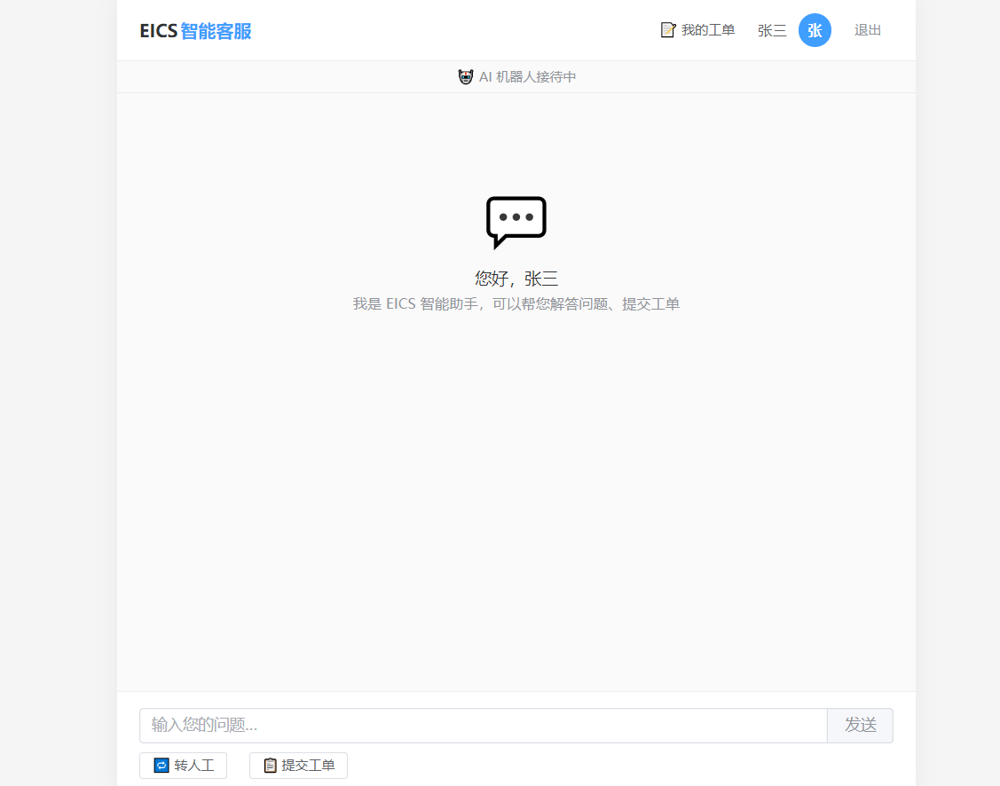
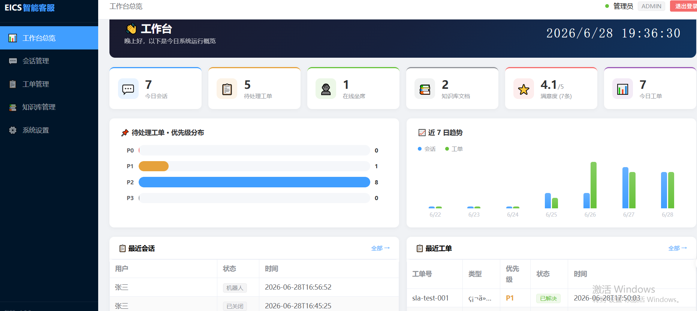
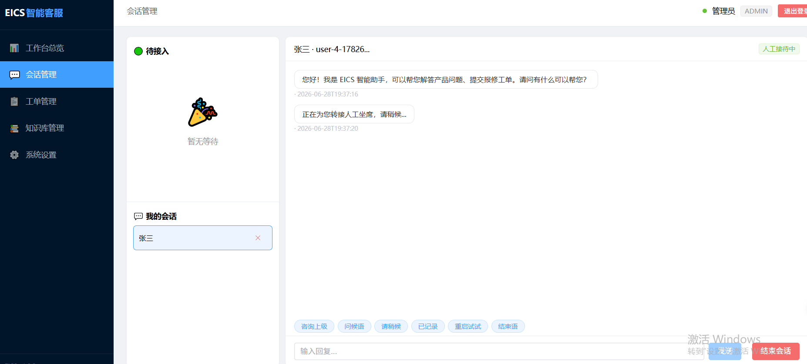
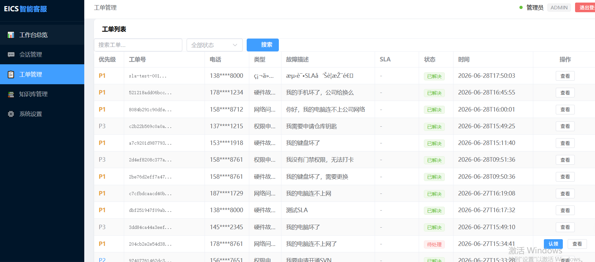
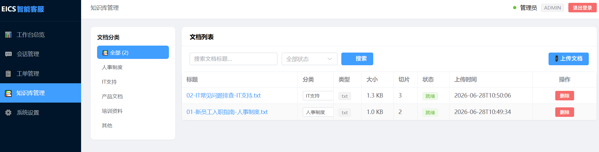
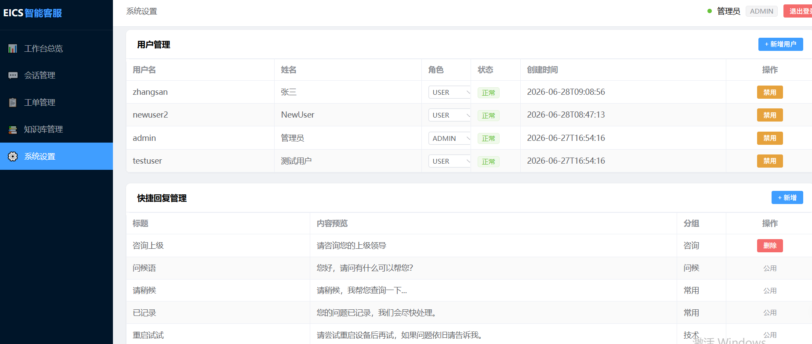

# EICS — Enterprise Integrated Customer Service System

企业一体化智能客服系统，纯 Java 技术栈，私有化部署。

[](LICENSE)
[](https://adoptium.net/)
[](https://spring.io/projects/spring-boot)
[](https://vuejs.org/)

- 🤖 **RAG 知识库问答**：Milvus 向量检索 + LLM 生成答案，附带文档溯源
- 📋 **多轮对话工单**：状态机驱动自动收集信息，LLM 增强实体提取
- 🔁 **AI 转人工坐席**：无缝转接 + WebSocket 实时聊天 + 会话留存
- 📊 **企业级管理后台**：工作台 / 会话管理 / 工单管理 / 知识库管理 / 系统设置
- ⭐ **满意度评价**：1-5 星评分，实时推送 + 补偿拉取
- 🔔 **SLA 超时告警**：WebSocket 实时推送，桌面通知
- 👥 **多角色用户系统**：USER / AGENT / ADMIN，JWT 认证

---

## 系统界面

### 用户端

| 智能客服对话 |
|:---:|
|  |
| 智能问答 · 多轮工单 · 一键转人工 · 满意度评价 |

### 管理后台

| 工作台总览 | 会话管理 |
|:---:|:---:|
|  |  |
| KPI 卡片 · 优先级分布 · 7日趋势 | 待接入队列 · 实时聊天 · 快捷回复 |

| 工单管理 | 知识库管理 |
|:---:|:---:|
|  |  |
| 优先级/SLA · 认领/解决 · 搜索筛选 | 分类侧栏 · 上传解析 · 向量检索 |

| 系统设置 |
|:---:|
|  |
| 用户管理 · 快捷回复 · 服务健康检查 |


---

## 技术栈

| 层 | 技术 |
|------|------|
| 后端 | Java 17 + Spring Boot 3.3 + Spring AI 1.0 |
| 对话引擎 | Java 状态机（主）+ LLM 增强实体提取 |
| ORM | MyBatis-Plus + MySQL 8.0 |
| 缓存 | Redis 7 |
| 向量库 | Milvus 2.4 (HNSW) |
| 文件存储 | MinIO |
| 前端 | Vue 3 + Element Plus + Vite |
| LLM | 阿里云 DashScope (Qwen-Max) |
| 部署 | Docker Compose 一键编排 |

---

## 快速启动

### 前置条件

- JDK 17+
- Node.js 18+
- Docker 24+ (含 Compose v2)
- 阿里云 DashScope API Key

### 1. 启动中间件

```bash
cd docker
cp .env.example .env          # 编辑 .env 填入 API Key 和密码
docker compose up -d
```

### 2. 启动后端

```bash
cd eics-server
mvn clean package -DskipTests
java -jar target/eics-server-v2-2.0.0-SNAPSHOT.jar
```

### 3. 启动前端

```bash
cd eics-web
npm install
npm run dev
```

### 4. 访问

| 页面 | 地址 |
|------|------|
| 聊天页面 | http://localhost:3000 |
| 管理后台 | http://localhost:3000/admin/dashboard |
| API 文档 | http://localhost:8080/swagger-ui.html |

> 默认管理员：`admin` / `admin123` | 默认用户：`testuser` / `admin123`

---

## 系统架构

```
┌────────────────────────────────────────────┐
│               Vue 3 前端 (Nginx)            │
│     ChatView · AdminLayout (6 页面)        │
└────────────────┬───────────────────────────┘
                 │ REST + WebSocket
┌────────────────▼───────────────────────────┐
│           Spring Boot 3.3 (Java 17)         │
│  ┌──────────┐ ┌──────────┐ ┌────────────┐  │
│  │ 对话引擎  │ │ RAG 模块  │ │  业务模块   │  │
│  │ Intent   │ │ 文档解析  │ │ 工单/坐席   │  │
│  │ Router   │ │ 向量检索  │ │ 满意度/SLA  │  │
│  │ State    │ │ LLM 生成  │ │ 快捷回复    │  │
│  │ Machine  │ │          │ │            │  │
│  └──────────┘ └──────────┘ └────────────┘  │
└────────────────┬───────────────────────────┘
                 │
┌────────────────▼───────────────────────────┐
│    MySQL · Redis · Milvus · MinIO          │
│    (Docker Compose 一键部署)                │
└────────────────────────────────────────────┘
```

---

## 项目结构

```
├── docker/                     # Docker Compose 编排 + SQL 初始化
├── eics-server/                # Java 后端
│   └── src/main/java/com/eics/
│       ├── dialog/             # 对话引擎（IntentRouter + FormStateMachine + EntityExtractor）
│       ├── controller/         # REST 接口
│       ├── service/            # 业务服务
│       ├── websocket/          # WebSocket 消息网关
│       └── entity/             # 数据实体
├── eics-web/                   # Vue 3 前端
│   └── src/
│       ├── views/admin/        # 管理后台（5 页面 + 工作台）
│       ├── layouts/            # AdminLayout
│       └── components/         # 通用组件（7 个）
└── docs/                       # 项目文档（7 份）
```

---

## 文档

| 文档 | 说明 |
|------|------|
| [部署手册](docs/01-部署手册.md) | 环境要求、安装步骤、配置说明 |
| [用户手册](docs/02-用户手册.md) | 聊天、工单、评价操作指南 |
| [管理员手册](docs/03-管理员手册.md) | 用户管理、工单、知识库、快捷回复 |
| [运维手册](docs/04-运维手册.md) | 备份恢复、故障排查、性能优化 |
| [需求规格说明书](docs/05-需求规格说明书.md) | 30 条功能需求 + 非功能需求 |
| [系统架构设计说明书](docs/06-系统架构设计说明书.md) | 架构图、模块划分、安全设计 |
| [数据库设计说明书](docs/07-数据库设计说明书.md) | ER 图、表结构、索引策略 |

---

## 环境变量

| 变量 | 必填 | 说明 |
|------|------|------|
| `DASHSCOPE_API_KEY` | ✅ | 阿里云 DashScope API Key |
| `JWT_SECRET` | ✅ | JWT 签名密钥（生产环境务必修改） |
| `MYSQL_ROOT_PASSWORD` | ✅ | MySQL root 密码 |
| `REDIS_PASSWORD` | ✅ | Redis 密码 |
| `MINIO_ROOT_PASSWORD` | ✅ | MinIO 管理员密码 |

详见 `docker/.env.example`。

---

## 生产部署

完整步骤参见 [部署手册](docs/01-部署手册.md)，包含服务器初始化、Docker 安装、防火墙配置、LLM 配置等。

---

## 贡献指南

欢迎提交 Issue 和 Pull Request。

1. Fork 本仓库
2. 创建特性分支：`git checkout -b feature/xxx`
3. 提交改动：`git commit -m 'Add xxx'`
4. 推送到分支：`git push origin feature/xxx`
5. 提交 Pull Request

---

## 鸣谢

本项目基于以下开源组件构建：

- [Spring Boot](https://spring.io/projects/spring-boot) — Java 应用框架
- [Spring AI](https://spring.io/projects/spring-ai) — AI 编排框架
- [MyBatis-Plus](https://baomidou.com/) — ORM 增强工具
- [Milvus](https://milvus.io/) — 向量数据库
- [MinIO](https://min.io/) — 对象存储
- [Element Plus](https://element-plus.org/) — Vue 3 UI 组件库
- [Redis](https://redis.io/) — 内存数据库

---

## License

MIT © [xbchenf](https://github.com/xbchenf)
